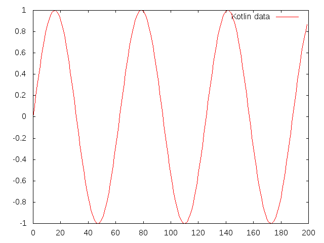
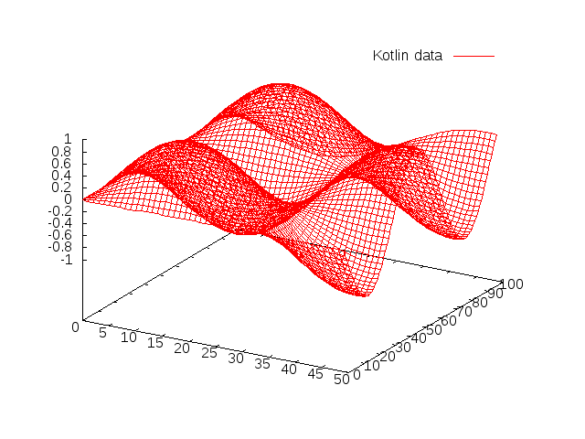
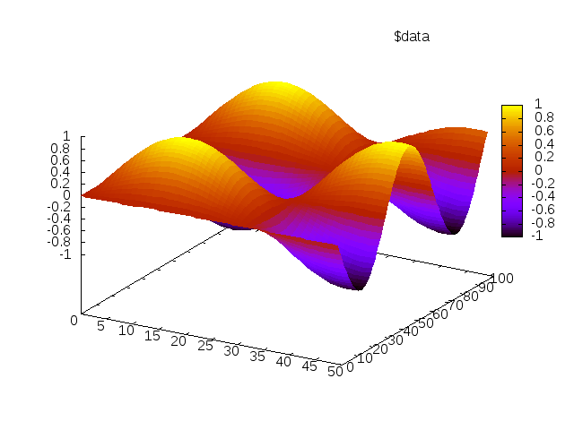
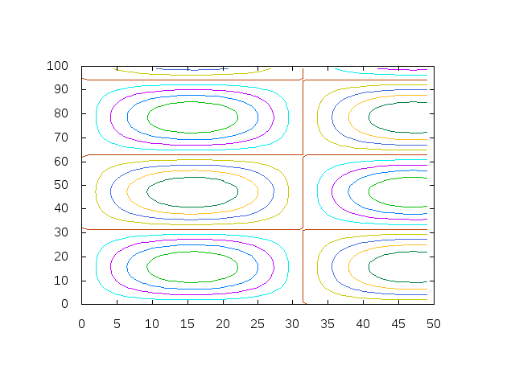

## Gnuplot for Kotlin

This is for anyone who knows how to use `gnuplot` and wants programmatic access to its plotting capabilities from Kotlin.
 
The `Gnuplot` class executes a `gnuplot` binary in a separate thread and sets up pipes to its inputs and outputs. This allows plotting commands and data to be piped to it from any Kotlin (or Java) program, and image files to be piped back.

Everything's in one class, so to install just copy the `Gnuplot.kt` file into your project. The class requires `gnuplot` version 5 or later to be installed on your system and be accessible in your path. It also makes use of the [Apache commons Exec](https://commons.apache.org/proper/commons-exec/) package, so make sure that's installed too.

To use, simply call the `gnuplot` method. The method expects a lambda function with a Gnuplot object as `this`. For example

```kotlin
  gnuplot {
    invoke("plot x*x with lines")
  }
```

gives


 Gnuplot's standard output can be piped to any `OutputStream` to create, for example, an image file. For example, the .png file above was created with this program:
```kotlin
  val file = FileOutputStream("img/xsquared.png")
  gnuplot(pipeOutputTo = file) {
    invoke("""set term png
              plot x*x with lines""")
  }
``` 
Sending data to gnuplot is most easily done by creating a "heredoc" and referring to it in the plot command. The `heredoc` method sends a heredoc to gnuplot and returns its name, which can then be used in a plot command. For example: 

```kotlin
   val data = Array(200) { x -> sin(x*0.1) }.asList()
   gnuplot {
     val myHeredoc = heredoc(data)
     invoke("plot $myHeredoc with lines")
   }
 ```

plots



Heredocs are sent in ASCII. Alternatively, data can be sent in binary format, which gives better performance. This can be done by calling the `write` method after the plot command. For example, the binary version of the above would be:
```kotlin
   val data = Array(200) { x -> sin(x*0.1) }.asList()
   gnuplot {
     invoke("plot '-' binary record=(200) using 1 with lines")
     write(data)
   }
 ```

Gnuplot's syntax for binary is a bit messy, so we supply the `binary` method as a convenience, which simply generates a string that is the part of the plot command that deals with the binary formatting. Using this, the above is written:
```kotlin
   val data = Array(200) { x -> sin(x*0.1) }.asList()
   gnuplot {
     invoke("plot ${binary(1,200)} with lines")
     write(data)
   }
 ```
 
 Gnuplot also doesn't allow `replot`s on plots of binary data. Instead, you have to combine all plots into one plot command. For example
```kotlin
   val data1 = Array(200) { x -> sin(x*0.1) }.asList()
   val data2 = Array(200) { x -> cos(x*0.1) }.asList()
   gnuplot {
     invoke("plot ${binary(1,200)} with lines, ${binary(1,200)} with points")
     write(data1)
     write(date2)
   }
 ```
 
In gnuplot, data is structured into fields, records, blocks and frames. Each field is just a number, each record consists of a fixed number of fields and contains data about a single point. Records are structured into one or more blocks. Blocks allow data to be given 2D structure where the block number gives the x-coordinate and the record number gives the y-coordinate. A frame is a set of blocks and multple frames can be used to produce animated plots by replotting frames in order.

Since gnuplot only receives a stream of numbers, sometimes you have to specify how the data should be split into records blocks and frames. For example, in a 3D plot, you need to specify how many fields there are in each record and how many records per block. If you're sending data in binary, there's also no way to specify the end of the file without closing the pipe, so if you want to issue more commands after the plot you also have to specify how many blocks you're sending. For example in the following, `binary(1,YSIZE,XSIZE)` tells gnuplot to expect one field per record (i.e. infer x and y coords from the position in the stream), `YSIZE` records per block and `XSIZE` blocks:

```kotlin
  val XSIZE = 50
  val YSIZE = 100
  val data2D = Array(XSIZE) { x ->
    Array(YSIZE) { y ->
      sin(x*0.1f)*sin(y*0.1f)
    }
  }
  val flatData = data2D.asSequence().flatMap { it.asSequence() }
   gnuplot {
     invoke("splot ${binary(1,YSIZE,XSIZE)} with lines")
     write(flatData)
   }
```

plots




The `Gnuplot.generateXSequence` and `Gnuplot.generateXYSequence` methods create sequences of integer coordinates in the correct order for piping to gnuplot, these can be used to generate data sequences when an appropriately ordered sequence isn't avaliable.

For example, the data for the above surface plot could have been generated using

```kotlin
  val XSIZE = 50
  val YSIZE = 100
  val plotData = gnuplot.generateXYSequence(XSIZE, YSIZE).map { coord ->
      Triple(coord.x, coord.y, sin(coord.x*0.1)*sin(coord.y*0.1))
  }
  gnuplot {
     val doc = heredoc(plotData,YSIZE)
     invoke("splot $doc with lines")
  }
```

Notice also that this time we chose to explicitly pipe the x, y and z coordinates in a `Triple`. The `heredoc` method recognises this, and automatically sets the number of fields per record to 3. However, we still have to tell it how many records per block.

Here's how to do it without `Triple`s:
```kotlin
  val XSIZE = 50
  val YSIZE = 100
  val flatData = gnuplot.generateXYSequence(XSIZE, YSIZE).flatMap { coord ->
      sequenceOf(coord.x, coord.y, sin(coord.x*0.1f)*sin(coord.y*0.1f))
  }
  
  gnuplot {
    val doc = heredoc(flatData, 3, YSIZE)
    invoke("splot $doc with pm3d")
  }
```


The rest is just [learning how to use gnuplot](http://gnuplot.info/)! For example, here's a contour plot

```kotlin
  val XSIZE = 50
  val YSIZE = 100
  val plotData = gnuplot.generateXYSequence(XSIZE, YSIZE).map { coord ->
      sin(coord.x*0.1f)*sin(coord.y*0.1f)*10.0f
  }
  gnuplot {
    invoke("""
        set contour
        unset surface
        set view map
        set cntrparam levels incremental -10,2,10
        set key off
        set xlabel 'xaxis'
        set ylabel 'yaxis'
        splot ${binary(1,YSIZE,XSIZE)} with lines
    """)
    write(plotData)
  }
```
which comes out like this



Finally, gnuplot reads its input in blocks, so if you're trying to do animations or interactive stuff, you may want to force gnuplot to read its input and plot immediately while keeping the pipe open for further commands. You can do this with the `flush()` method.
