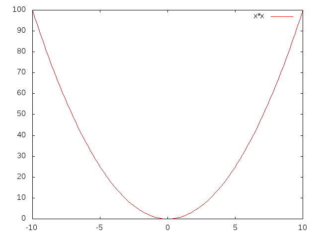

## Gnuplot for Kotlin

This is for anyone who knows how to use `gnuplot` and wants programmatic access to its plotting capabilities from Kotlin.
 
The `Gnuplot` class executes a `gnuplot` binary in a thread and sets up pipes to its inputs and outputs. This allows plotting commands and data to be piped to it from any Kotlin (or Java) program.

Everything's in one class, so to install just copy the `Gnuplot.kt` file into your project. The class requires `gnuplot` to be installed on your system and accessible in your path. It also makes use of the [Apache commons Exec](https://commons.apache.org/proper/commons-exec/) package, so make sure that's installed too.

To use, simply create an instance of the `Gnuplot` class and start piping gnuplot commands to it.

```kotlin
  val gnuplot = Gnuplot()
  gnuplot("plot x*x with lines")
  gnuplot.close()
```

gives



 Gnuplot's standard output can be piped to any `OutputStream` to create, for example, an image file. For example, the .png file above was created with this program:
```kotlin
  val file = FileOutputStream("img/xsquared.png")
  val gnuplot = Gnuplot(pipeOutputTo = file)
  gnuplot("set term png")
  gnuplot("plot x*x with lines")
  gnuplot.close()
``` 
 
The `plot` method is a convenient way to access gnuplot's `plot` command. The data for the plot is supplied as a `Sequence<Float>` (gnuplot uses floats internally, so no point sending doubles).  For example...

```kotlin
   val data = Array(200) { x -> sin(x*0.1f) }
   val gnuplot = Gnuplot()
   gnuplot.plot(data.asSequence(), inferXCoord = true)
   gnuplot.close()
 ```

plots


Notice the `inferXCoord=true` parameter, which tells gnuplot that we're just sending a list of Y values, and the X values should be inferred from Y's position in the sequence. When this parameter is `false` (the default) you'll need to send (X,Y) pairs.

Similarly, the `splot` method gives access to surface plots. Data is still sent as a (flattened) `Sequence<Float>`, data points should be ordered as (x0,y0), (x0,y1)...(x0,yn), (x1,y0)... You can manipulate your data into an appropriate `Sequence<Float>` using `map` and `flatmap`. Because sequences are lazily evaluated, large datasets can be manipulated this way without any memory overhead. For example

```kotlin
  val XSIZE = 50
  val YSIZE = 100
  val data2D = Array(XSIZE) { x ->
    Array(YSIZE) { y ->
      sin(x*0.1f)*sin(y*0.1f)
    }
  }

  val gnuplot = Gnuplot()
  val plotData = data2D.asSequence().flatMap { it.asSequence() }
   gnuplot.splot(plotData, XSIZE, YSIZE, inferXYCoords = true)
   gnuplot.close()
```

plots


The `generateXSequence` and `generateXYSequence` methods create sequences of integer coordinates in the correct order for piping to gnuplot, these can be used to generate data sequences when an appropriately ordered sequence isn't avaliable.

For example, the above surface plot could have been generated using

```kotlin
  val XSIZE = 50
  val YSIZE = 100
  val gnuplot = Gnuplot()
  val plotData = gnuplot.generateXYSequence(XSIZE, YSIZE).flatMap { coord ->
      sequenceOf(coord.x, coord.y, sin(coord.x*0.1f)*sin(coord.y*0.1f))
  }
  gnuplot.splot(plotData, XSIZE, YSIZE)
  gnuplot.close()
```

Notice also that this time we chose to explicitly pipe the x and y coordinates, so we removed the `inferXYCoords=true` from the parameters of `splot`.

If you have gnuplot version 5.0 or above, you can also define "here-documents" using the `define` method. This allows you to transfer a dataset to gnuplot and give it a name which you can refer to later in plot commands by replacing the filename with the here-document name, prefixed with a "$". The `undefine` method tells gnuplot to release the data.

The data is structured into fields, records, blocks and frames. Each field is just a floating point number, each record consists of a fixed number of fields and contains data about a single point. Records are structured into one or more blocks. Multiple blocks allows data to be given 2D structure where the block number gives the x-coordinate and the record number gives the y-coordinate. A frame is a set of blocks and multple frames can be used to produce animated plots by replotting frames in order.

Here's a simple example of here-documents in use:
```kotlin
  val XSIZE = 50
  val YSIZE = 100
  val plotData = gnuplot.generateXYSequence(XSIZE, YSIZE).flatMap { coord ->
      sequenceOf(coord.x, coord.y, sin(coord.x*0.1f)*sin(coord.y*0.1f))
  }
  
  val gnuplot = Gnuplot()
  gnuplot.define("data", plotData, 3, YSIZE)
  gnuplot("splot \$data with pm3d")
  gnuplot.undefine("data")
  gnuplot.close()
```


The rest is just [learning how to use gnuplot](http://gnuplot.info/)! For example, here's a contour plot

```kotlin
  val XSIZE = 50
  val YSIZE = 100
  val gnuplot = Gnuplot()
  gnuplot("set contour")
  gnuplot("unset surface")
  gnuplot("set view map")
  gnuplot("set cntrparam levels incremental -10,2,10")
  gnuplot("set key off")
  val plotData = gnuplot.generateXYSequence(XSIZE, YSIZE).map { coord ->
      sin(coord.x*0.1f)*sin(coord.y*0.1f)*10.0f
  }
  gnuplot.splot(plotData, XSIZE, YSIZE, inferXYCoords = true)

```
which comes out like this


Finally, gnuplot reads its input in blocks, so if you're trying to do animations or interactive stuff, you may want to force gnuplot to read its input and plot immediately while keeping the pipe open for further commands. You can do this with the `flush()` method.
